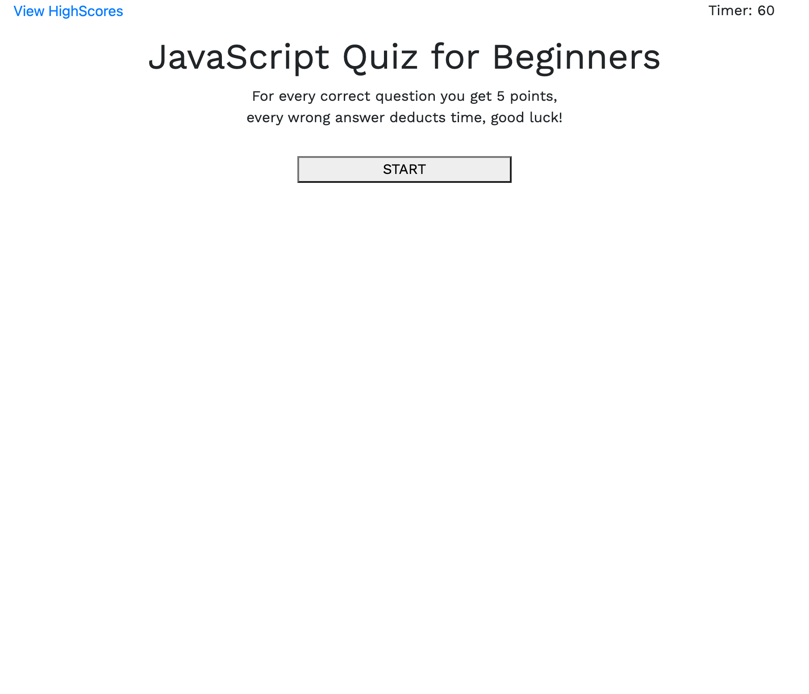
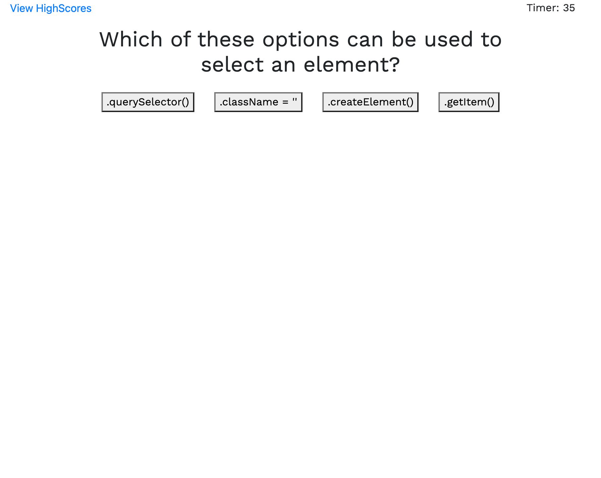

# JavaScript Quiz

An application that will run a timed quiz with multiple choice questions, give points for every correct answer selected by the user and deduct time for every wrong answer. 

## Usage
* When the start button is clicked the timer starts counting down and the first question and set of answers are displayed.
* Once an answer is selected points are added for correct answers, time deducted for wrong answers and the next question displays, this repeats until either all questions are answered or the timer runs out
* Once the quiz ends the player can enter their initials and view their highscore.
* Start screen includes a link to view past High Scores

## Link to Deployed Application:
https://crossigarcia.github.io/quiz

## Screenshot of Application

